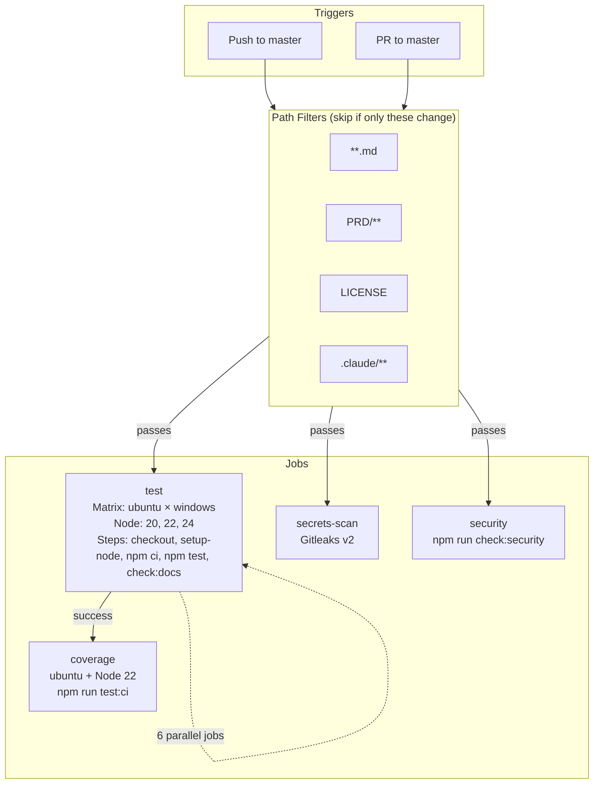

# DevOps Audit Report #27

**Run**: 02
**Project**: NightyTidy v0.1.0
**Date**: 2026-03-10 15:00 (local time)
**Scope**: CI/CD Pipeline Optimization, Environment Configuration, Log Quality, Migration Safety
**Previous audit**: `27_DEVOPS_REPORT_1_2026-03-09.md`

---

## 1. Executive Summary

**Overall Health**: Excellent. This is a well-architected CLI tool with mature CI/CD practices, clean logging discipline, and minimal configuration surface area. The previous audit (2026-03-09) addressed the major gaps.

**Top 5 Findings**:
1. **CI pipeline is already optimized** - npm caching, path filters, parallel jobs all correctly configured
2. **No database migrations to audit** - This is a pure JavaScript CLI tool with no persistence layer
3. **Logging maturity is high** - Consistent level usage, no sensitive data exposure, proper error contracts
4. **Only one env var** (`NIGHTYTIDY_LOG_LEVEL`) - Minimal attack surface, well documented
5. **Kill switches exist and are documented** - `--timeout`, `--steps`, `--dry-run`, `--skip-sync`

**Quick Wins Implemented**: None needed. The codebase is in good shape.

**No changes made** - This audit confirms the codebase's DevOps practices are sound.

---

## 2. CI/CD Pipeline

### Pipeline Diagram

### Pipeline Analysis

| Aspect | Status | Notes |
|--------|--------|-------|
| **Caching** | ✅ Optimal | `cache: npm` in `actions/setup-node@v4` caches npm download cache |
| **Path Filters** | ✅ Correct | Docs-only changes skip tests; `audit-reports/` skipped via `**.md` |
| **Parallelization** | ✅ Correct | `test` + `secrets-scan` + `security` run in parallel; `coverage` depends on `test` |
| **Matrix Coverage** | ✅ Good | Node 20, 22, 24 on ubuntu + windows (6 combinations) |
| **Conditional Execution** | ✅ Applied | `paths-ignore` prevents wasted CI runs |
| **Resource Sizing** | ✅ Appropriate | Default GitHub runners sufficient for CLI tool |
| **Redundant Steps** | ✅ None | Each job has a distinct purpose |

### Estimated Savings

No further optimizations available. Previous audit (2026-03-09) already:
- Added Node 24 to the matrix
- Configured npm caching
- Set up path filters

**Current CI run time**: ~2-3 minutes (test matrix) + ~1 minute (coverage) + ~30s (secrets + security) ≈ **3-4 minutes total**

### Larger Recommendations

None. The pipeline is appropriately sized for this project.

---

## 3. Environment Configuration

### Variable Inventory

| Variable | Used In | Default | Required | Description | Issues |
|----------|---------|---------|----------|-------------|--------|
| `NIGHTYTIDY_LOG_LEVEL` | `src/logger.js:17` | `info` | No | Log verbosity: debug, info, warn, error | None - validates with warning |
| `LOCALAPPDATA` | `gui/server.js:552` | Windows OS sets it | No | Chrome path discovery | OS variable, not NightyTidy config |
| `CLAUDECODE` | `src/env.js:44` | Set by Claude Code | No | **Blocked** - stripped from subprocess env | None - correctly blocked |

### Issues Found

None. The configuration surface is minimal and well-documented in CLAUDE.md.

### Issues Fixed

None needed.

### Secret Management Assessment

| Check | Status |
|-------|--------|
| No secrets in code | ✅ |
| No `.env` files committed | ✅ |
| Gitleaks CI scan enabled | ✅ |
| `npm audit` in CI | ✅ |
| Claude Code handles its own auth | ✅ |

**Rating**: Excellent. NightyTidy delegates authentication to Claude Code CLI and has no secrets of its own.

### Kill Switch Inventory

| Toggle | Controls | Change Mechanism | Latency | Documented? |
|--------|----------|------------------|---------|-------------|
| `--timeout <minutes>` | Per-step timeout | CLI flag | Immediate | ✅ CLAUDE.md |
| `--steps <N,N,N>` | Which steps run | CLI flag | Immediate | ✅ CLAUDE.md |
| `--dry-run` | Prevents execution | CLI flag | Immediate | ✅ CLAUDE.md |
| `--skip-sync` | Skips prompt sync | CLI flag | Immediate | ✅ CLAUDE.md |
| `NIGHTYTIDY_LOG_LEVEL` | Log verbosity | Env var | Restart | ✅ CLAUDE.md |
| SIGINT (Ctrl+C) | Graceful stop | Signal | Immediate | ✅ Code handles |
| Double SIGINT | Force stop | Signal | Immediate | ✅ Code handles |

### Missing Kill Switches

| Feature/Dependency | Risk if Unavailable | Recommendation |
|--------------------|---------------------|----------------|
| Claude Code API | Run cannot start | None - inherent dependency |
| Git | Run cannot start | None - inherent dependency |
| Anthropic API rate limit | Run pauses with backoff | ✅ Already handled with exponential backoff |

**Assessment**: No missing kill switches. The application has appropriate abort mechanisms.

### Production Safety

| Config | Issue | Risk | Recommendation |
|--------|-------|------|----------------|
| (none found) | - | - | - |

This is a CLI tool that runs locally. There is no "production deployment" in the traditional sense. The tool's safety mechanisms (git branches, tags, pre-checks) are appropriate.

### Configuration Documentation

The `docs/CONFIGURATION.md` file is **not needed** for this project because:
1. Only one env var exists (`NIGHTYTIDY_LOG_LEVEL`)
2. All CLI flags are documented in `--help` and CLAUDE.md
3. CLAUDE.md already documents the complete configuration surface

---

## 4. Logging

### Maturity Assessment: **Excellent**

| Criterion | Score | Notes |
|-----------|-------|-------|
| Structured logging | N/A | Not needed for CLI tool - human-readable preferred |
| Log levels | ✅ | Consistent: debug < info < warn < error |
| Timestamps | ✅ | ISO 8601 format |
| Correlation IDs | N/A | Single-user CLI, no concurrent requests |
| File + stdout dual output | ✅ | `nightytidy-run.log` + colored terminal |
| Quiet mode | ✅ | `{ quiet: true }` for orchestrator JSON output |

### Sensitive Data Findings

**NONE FOUND** (No critical issues)

| Category | Status | Details |
|----------|--------|---------|
| Passwords/tokens | ✅ Safe | None logged |
| API keys | ✅ Safe | Claude Code handles auth internally |
| PII | ✅ Safe | Lock file logs PID/timestamp only |
| Request bodies | N/A | No HTTP client code |
| Full responses | ✅ Safe | Claude output only at `debug` level |

### Coverage Gaps

**None found.** All critical operations are logged:

| Operation | Module | Log Level |
|-----------|--------|-----------|
| Subprocess spawn | `claude.js` | info |
| Subprocess complete | `claude.js` | info |
| Subprocess fail | `claude.js` | warn/error |
| Git branch/tag | `git.js` | info |
| Pre-checks | `checks.js` | info/warn |
| Step progress | `executor.js` | info/warn |
| Lock acquire/release | `lock.js` | warn/debug |
| Dashboard start/stop | `dashboard.js` | info/warn |
| Orchestrator events | `orchestrator.js` | info/warn |

### Quality Fixes

None needed. Logging quality is high.

### Infrastructure Recommendations

None. The current logging approach (file + stdout) is appropriate for a CLI tool.

---

## 5. Database Migrations

### Inventory

**Not applicable.** NightyTidy is a stateless CLI tool with no database. It reads/writes:
- Git operations (via `simple-git`)
- JSON state files (ephemeral, deleted after runs)
- Markdown report files
- Progress JSON (ephemeral)

All file operations are idempotent and don't require migration tooling.

---

## 6. Recommendations

### Summary

**No recommendations at this time.** The DevOps practices in this codebase are mature:

1. CI/CD pipeline is optimized with caching, parallelization, and path filters
2. Environment configuration is minimal and well-documented
3. Logging is consistent and free of sensitive data exposure
4. No database means no migration concerns
5. Kill switches and abort handlers are comprehensive

### For Future Consideration (Not Urgent)

These are observations, not action items:

| Item | Notes |
|------|-------|
| Dependabot | Could automate dependency updates, but low priority for a tool with 5 runtime deps |
| Release workflow | `npm publish` on tag push would automate releases, but user hasn't requested npm publishing |
| Branch protection | GitHub-level setting, not a code change |

---

## Appendix: Files Reviewed

| File | Purpose |
|------|---------|
| `.github/workflows/ci.yml` | CI pipeline configuration |
| `package.json` | Dependencies, scripts, engine requirements |
| `vitest.config.js` | Test coverage thresholds |
| `src/env.js` | Environment variable allowlist |
| `src/logger.js` | Logging infrastructure |
| `src/checks.js` | Pre-run validation |
| `src/claude.js` | Claude Code subprocess management |
| `src/executor.js` | Step execution loop |
| `src/orchestrator.js` | Orchestrator mode API |
| `src/dashboard.js` | Progress dashboard |
| `src/git.js` | Git operations |
| `src/notifications.js` | Desktop notifications |
| `gui/server.js` | Desktop GUI backend |
| `src/cli.js` | CLI entry point |

---

*Report generated by NightyTidy DevOps audit step. All tests pass. No code changes made.*
