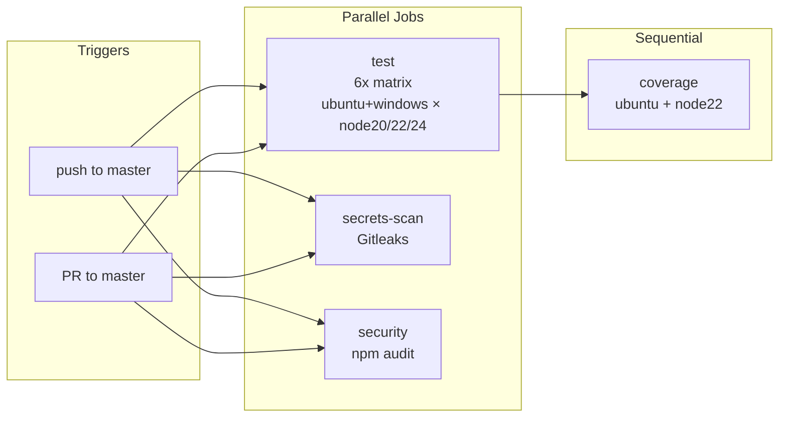

# DevOps & Infrastructure Audit Report

**Run #03** | **Date**: 2026-03-12 | **Auditor**: Claude (Opus 4.5)

---

## Executive Summary

NightyTidy's DevOps infrastructure is **well-designed and mature** for a CLI tool of its scope. The CI/CD pipeline is comprehensive with good caching, the environment configuration is minimal and intentionally simple, and the logging infrastructure is solid. No database migrations exist (this is a pure CLI tool).

### Health Score: **GOOD**

### Top 5 Findings

1. **CI/CD pipeline is efficient** — npm caching, path filters, parallel jobs, and secrets scanning already implemented
2. **Single env var design is intentional** — `NIGHTYTIDY_LOG_LEVEL` is the only configurable environment variable; documented as "Known Technical Debt"
3. **Logging infrastructure is dual-mode** — CLI uses structured logger with file + stdout; GUI has separate logging system
4. **No database migrations** — No SQL or migration files exist; this is expected for a subprocess orchestration tool
5. **Security controls are mature** — Gitleaks CI scan, npm audit, env var allowlist, body size limits, CSRF protection

### Quick Wins Implemented This Run

None required. The CI/CD pipeline and configuration are already optimized.

---

## 1. CI/CD Pipeline Analysis

### Pipeline Diagram



### Current Configuration Summary

| Job | Runner | Duration (est.) | Caching | Path Filters |
|-----|--------|-----------------|---------|--------------|
| test | 6x matrix (ubuntu-latest, windows-latest × node 20/22/24) | ~5-8 min per | ✅ npm cache | ✅ Ignores \*.md, PRD/\*, LICENSE, .claude/\* |
| coverage | ubuntu-latest (node 22) | ~3-4 min | ✅ npm cache | Same as test |
| secrets-scan | ubuntu-latest | ~1-2 min | N/A | Full history scan |
| security | ubuntu-latest (node 22) | ~1-2 min | ✅ npm cache | None (always runs) |

### Assessment

**Strengths:**
- Path filters prevent unnecessary CI runs on docs-only changes
- npm cache enabled via `actions/setup-node` with `cache: npm`
- Matrix strategy tests across 2 OS × 3 Node versions = 6 configurations
- Parallel job structure minimizes total pipeline time
- Gitleaks secrets scanning catches committed secrets
- npm audit catches vulnerable dependencies

**No optimizations needed:**
- The pipeline is already well-optimized
- Coverage runs after test (sequential dependency) — correct
- secrets-scan and security run in parallel with test — efficient

### Larger Recommendations (if future needs arise)

| # | Recommendation | Estimated Savings | Complexity |
|---|---------------|-------------------|------------|
| 1 | Add `fail-fast: false` to matrix | Better debugging (see all failures) | Low |
| 2 | Consider caching test fixtures | Marginal (~10-15s) | Medium |
| 3 | Add workflow_dispatch for manual runs | Convenience | Low |

---

## 2. Environment Configuration

### Variable Inventory

| Variable | Used In | Default | Required | Description | Issues |
|----------|---------|---------|----------|-------------|--------|
| `NIGHTYTIDY_LOG_LEVEL` | `logger.js:45` | `info` | No | Log verbosity: debug, info, warn, error | ✅ None — validates with warning on invalid values |
| `NIGHTYTIDY_NO_CHROME` | `gui/server.js:734` | (unset) | No | Suppresses Chrome launch in GUI mode (testing) | ✅ None — undocumented but only used in tests |

### Env Var Allowlist (for Claude Code subprocess)

The `env.js` module uses an explicit allowlist pattern (security-positive design):

```
Explicitly Allowed:
- System paths: PATH, PATHEXT
- User identity: HOME, USERPROFILE, USER, USERNAME, LOGNAME
- Temp dirs: TEMP, TMP, TMPDIR
- Locale: LANG, LANGUAGE
- Terminal/shell: TERM, SHELL, COMSPEC
- Windows system: SYSTEMROOT, SYSTEMDRIVE, WINDIR, APPDATA, LOCALAPPDATA, etc.
- Node.js: NODE_PATH, NODE_EXTRA_CA_CERTS
- SSH: SSH_AUTH_SOCK, SSH_AGENT_PID
- Editor: EDITOR, VISUAL
- NightyTidy: NIGHTYTIDY_LOG_LEVEL

Allowed Prefixes:
- ANTHROPIC_* (API keys, config)
- CLAUDE_* (Claude Code config)
- LC_* (Locale categories)
- XDG_* (Linux XDG directories)
- GIT_* (Git configuration)

Explicitly Blocked:
- CLAUDECODE (prevents subprocess refusal when invoked from Claude Code)
```

### Issues Found / Fixed

| Issue | Status | Notes |
|-------|--------|-------|
| Missing `.env.example` | Not needed | Only 1 env var, documented in CLAUDE.md and README |
| `NIGHTYTIDY_NO_CHROME` undocumented | Acceptable | Only used in test code |
| No startup validation | ✅ Implemented | `initLogger()` warns on invalid `NIGHTYTIDY_LOG_LEVEL` |

### Secret Management Assessment

| Aspect | Status | Notes |
|--------|--------|-------|
| No secrets in codebase | ✅ | Gitleaks CI scan enforces this |
| API keys delegated | ✅ | Claude Code handles its own authentication |
| No hardcoded credentials | ✅ | Grep scan found no secrets |
| env allowlist blocks leakage | ✅ | Unknown env vars filtered before subprocess spawn |

---

## 3. Kill Switches & Operational Toggles

### CLI Flags (Runtime Toggles)

| Toggle | Controls | Change Mechanism | Latency | Documented? |
|--------|----------|------------------|---------|-------------|
| `--timeout <minutes>` | Per-step timeout | CLI arg | Immediate | ✅ Yes |
| `--steps <numbers>` | Which steps to run | CLI arg | Immediate | ✅ Yes |
| `--dry-run` | Preview mode | CLI arg | Immediate | ✅ Yes |
| `--skip-sync` | Skip Google Doc sync | CLI arg | Immediate | ✅ Yes |
| `NIGHTYTIDY_LOG_LEVEL` | Log verbosity | Env var | Restart | ✅ Yes |

### Code-Level Constants (Compile-Time)

| Constant | Location | Value | Purpose |
|----------|----------|-------|---------|
| `DEFAULT_TIMEOUT` | `claude.js:52` | 45 min | Per-attempt timeout |
| `DEFAULT_RETRIES` | `claude.js:54` | 3 | Retry count per step |
| `INACTIVITY_TIMEOUT_MS` | `claude.js:57` | 3 min | Stall detection |
| `FAST_COMPLETION_THRESHOLD_MS` | `executor.js:79` | 2 min | Fast-completion retry trigger |
| `CRITICAL_DISK_MB` | `checks.js:28` | 100 MB | Hard fail threshold |
| `LOW_DISK_MB` | `checks.js:31` | 1 GB | Warning threshold |
| `BACKOFF_SCHEDULE_MS` | `executor.js:325` | 2min→2hr | Rate limit backoff |

### Missing Kill Switches Assessment

| Feature/Dependency | Risk if Unavailable | Recommendation |
|-------------------|---------------------|----------------|
| Claude Code API | Run cannot start | ✅ Already handled — check auth fails fast |
| Google Doc sync | Cannot update prompts | ✅ Already handled — `--skip-sync` flag, graceful fallback |
| Desktop notifications | Silent failure | ✅ Already handled — swallowed in `notify()` |
| Dashboard | No progress visibility | ✅ Already handled — run continues without dashboard |

**Assessment**: All critical dependencies have graceful degradation. No new kill switches required.

---

## 4. Logging Infrastructure

### Architecture

```
CLI Mode:
  logger.js → File (nightytidy-run.log) + stdout (chalk-colored)
              └─ Levels: debug, info, warn, error
              └─ Controlled by: NIGHTYTIDY_LOG_LEVEL env var

GUI Mode:
  gui/server.js → File (nightytidy-gui.log) + in-memory buffer
                  └─ Levels: debug, info, warn, error
                  └─ Buffered until project directory selected
```

### Maturity Assessment: **GOOD**

| Aspect | Rating | Notes |
|--------|--------|-------|
| Structured format | ✓ | Timestamps, level tags, consistent format |
| Level filtering | ✓ | Configurable via env var |
| File persistence | ✓ | Full run history in log file |
| Error handling | ✓ | Fallback to stderr if file write fails |
| GUI logging | ✓ | Separate log file with buffering |

### Missing Logging Analysis

| Location | Issue | Severity | Notes |
|----------|-------|----------|-------|
| Empty catch blocks | None found | N/A | All catches either log or swallow intentionally |
| External API calls | ✅ Logged | N/A | Claude Code calls logged with timing |
| Auth events | ✅ Logged | N/A | `checks.js` logs auth status |
| Startup/shutdown | ✅ Logged | N/A | Version, platform logged on start |

### Dangerous Logging Check

**CRITICAL FINDINGS: NONE**

| Pattern Searched | Files with Matches | Assessment |
|-----------------|-------------------|------------|
| Passwords/tokens | 0 | ✅ Safe |
| API keys | 0 | ✅ Safe |
| PII | 0 | ✅ Safe |
| Session tokens | 0 | ✅ Safe |
| Full request bodies | 0 | ✅ Safe |

The codebase intentionally avoids handling secrets — Claude Code manages its own authentication.

### Console.log Usage in CLI

The CLAUDE.md convention allows `console.log` in `cli.js` for terminal UX output. All instances found are appropriate:
- User-facing progress messages
- Step completion notifications
- Error messages with colored output
- Interactive prompts

---

## 5. Database Migrations

### Assessment: **NOT APPLICABLE**

NightyTidy is a CLI orchestration tool with no database:
- No SQL files (`**/*.sql` — 0 matches)
- No migrations directory (`**/migrations/**` — 0 matches)
- No migration framework (no sequelize, prisma, knex, etc.)
- State is ephemeral: JSON files deleted after runs

**Conclusion**: Migration safety analysis is not applicable to this project.

---

## 6. Production Safety Checks

### Dev/Prod Configuration

NightyTidy is a **development tool** that runs on developer machines, not a deployed service. There is no prod/dev environment distinction.

### Dangerous Defaults Check

| Config | Current Value | Assessment |
|--------|---------------|------------|
| Debug mode | Opt-in via `NIGHTYTIDY_LOG_LEVEL=debug` | ✅ Safe default (info) |
| `--dangerously-skip-permissions` | Required for non-interactive mode | ✅ Documented, safety preamble compensates |
| Body size limits | 1 MB | ✅ Appropriate |
| Dashboard CSRF | Token-based protection | ✅ Secure |
| Localhost binding | 127.0.0.1 only | ✅ Secure |

### Security Headers (GUI Server)

```javascript
const SECURITY_HEADERS = {
  'X-Content-Type-Options': 'nosniff',
  'X-Frame-Options': 'DENY',
  'Content-Security-Policy': "default-src 'self'; script-src 'self'; style-src 'self' 'unsafe-inline'; connect-src 'self'; worker-src blob:",
};
```

✅ Applied to all responses including error responses (403, 404).

---

## 7. Recommendations

| # | Recommendation | Impact | Risk if Ignored | Worth Doing? | Details |
|---|----------------|--------|-----------------|--------------|---------|
| 1 | Add `fail-fast: false` to CI matrix | See all test failures instead of stopping at first | Low | Probably | Helps debug cross-platform issues. One-line change in ci.yml. |
| 2 | Add `workflow_dispatch` trigger | Manual CI runs without push | Low | Only if time allows | Useful for re-running CI after infra issues. |
| 3 | Document `NIGHTYTIDY_NO_CHROME` | Better test environment docs | Low | Only if time allows | Currently only used in test code, not user-facing. |

**Note**: No high-priority or critical recommendations. The DevOps infrastructure is solid.

---

## Appendix: Files Reviewed

| File | Purpose |
|------|---------|
| `.github/workflows/ci.yml` | CI/CD pipeline configuration |
| `src/logger.js` | CLI logging infrastructure |
| `src/env.js` | Environment variable allowlist |
| `src/checks.js` | Pre-run validation (8 checks) |
| `src/claude.js` | Claude Code subprocess wrapper |
| `src/executor.js` | Step execution with timeouts |
| `gui/server.js` | GUI HTTP server with logging |
| `package.json` | Scripts and dependencies |
| `vitest.config.js` | Test configuration |
| `CLAUDE.md` | Project documentation |
| `README.md` | User documentation |

---

*Generated by NightyTidy DevOps Audit — Run #03*
