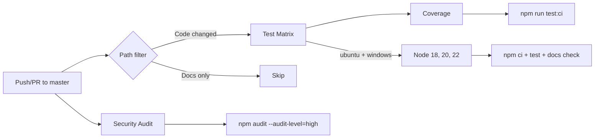

# DevOps & Infrastructure Audit Report

**Project**: NightyTidy v0.1.0
**Date**: 2026-03-05
**Run**: 01
**Branch**: `devops-audit-2026-03-05`

---

## 1. Executive Summary

NightyTidy is a CLI tool with no deploy pipeline, no database, and minimal configuration surface. The project is well-structured for its scope but had **zero CI/CD automation** — the single highest-impact gap. Logging is solid with proper level usage and structured output. Configuration is minimal by design (one env var) but lacked validation.

**Top 5 improvements (by impact):**
1. **Created GitHub Actions CI** — test matrix (3 Node versions x 2 OSes), coverage enforcement, docs check, security audit
2. **Added path filters** — CI skips on markdown/PRD/LICENSE-only changes
3. **Added env var validation** — invalid `NIGHTYTIDY_LOG_LEVEL` now warns instead of silently defaulting
4. **Added ephemeral files to .gitignore** — `nightytidy-progress.json`, `nightytidy-dashboard.url`, `nightytidy.lock`
5. **Added `files` field to package.json** — clean npm publish (only `bin/`, `src/`, LICENSE, README)

**Quick wins implemented**: CI pipeline, env var validation, .gitignore completeness, npm publish config.

---

## 2. CI/CD Pipeline

### Before Audit

**No CI/CD pipeline existed.** No GitHub Actions, no GitLab CI, no Jenkinsfile, no Dockerfile, no deploy automation of any kind. All testing was manual via `npm test`.

### Pipeline Created

**File**: `.github/workflows/ci.yml`

| Job | Runs on | Depends on | Estimated duration |
|-----|---------|-----------|-------------------|
| `test` | ubuntu-latest + windows-latest, Node 18/20/22 (6 combos) | — | ~2 min each |
| `coverage` | ubuntu-latest, Node 22 | test | ~1 min |
| `security` | ubuntu-latest, Node 22 | — | ~30s |

**Optimizations implemented:**
- **npm cache** via `actions/setup-node` cache parameter
- **Path filters** — skips CI on `.md`, `PRD/`, `LICENSE`, `.claude/` changes
- **Parallel jobs** — security audit runs independently of test matrix
- **Coverage gated** on test pass to avoid wasted runs

### Larger Recommendations

| Improvement | Estimated savings | Effort |
|------------|------------------|--------|
| Add `npm publish` workflow on tag push | Eliminates manual publish step | 30 min |
| Add automated release notes via `gh release` | Saves time writing changelogs | 1 hour |

---

## 3. Environment Configuration

### Variable Inventory

| Variable | Used In | Default | Required | Description | Issues |
|----------|---------|---------|----------|-------------|--------|
| `NIGHTYTIDY_LOG_LEVEL` | `logger.js:15` | `info` | No | Log verbosity: debug, info, warn, error | **Fixed**: now warns on invalid values |
| `CLAUDECODE` | `claude.js:28`, `checks.js:13` | (set by Claude Code) | No | Stripped to prevent nesting detection | None |

### Hardcoded Constants (intentionally not configurable)

| Constant | File | Value | Rationale |
|----------|------|-------|-----------|
| `DEFAULT_TIMEOUT` | `claude.js:5` | 45 min | Exposed via `--timeout` CLI flag |
| `DEFAULT_RETRIES` | `claude.js:6` | 3 | Sensible default, not worth env var |
| `RETRY_DELAY` | `claude.js:7` | 10s | Internal retry backoff |
| `STDIN_THRESHOLD` | `claude.js:8` | 8000 chars | OS command-line limit avoidance |
| `AUTH_TIMEOUT_MS` | `checks.js:5` | 30s | Fast-fail on auth check |
| `CRITICAL_DISK_MB` | `checks.js:6` | 100 MB | Hard stop threshold |
| `LOW_DISK_MB` | `checks.js:7` | 1024 MB | Warning threshold |
| `MAX_LOCK_AGE_MS` | `lock.js:7` | 24 hours | Stale lock detection |
| `SHUTDOWN_DELAY` | `dashboard.js:10` | 3s | Dashboard graceful shutdown |
| `MAX_NAME_RETRIES` | `git.js:8` | 10 | Branch/tag name collision retries |

**Assessment**: These are all reasonable internal constants. Making them configurable would add complexity without value (YAGNI). The only user-facing tunable (`--timeout`) is already exposed via CLI.

### Kill Switch Inventory

| Toggle | Controls | Change Mechanism | Latency | Documented? |
|--------|----------|-----------------|---------|-------------|
| `--timeout <min>` | Per-step Claude Code timeout | CLI flag | Immediate (next run) | Yes (README) |
| `--steps <nums>` | Which steps to run | CLI flag | Immediate | Yes (README) |
| `--dry-run` | Skip execution | CLI flag | Immediate | Yes (README) |
| `NIGHTYTIDY_LOG_LEVEL` | Log verbosity | Env var | Immediate (next run) | Yes (CLAUDE.md, README) |

### Missing Kill Switches

| Feature/Dependency | Risk if Unavailable | Recommendation |
|-------------------|-------------------|----------------|
| Claude Code subprocess | Entire tool is non-functional | N/A — core dependency, can't degrade gracefully |
| Desktop notifications | Minor UX loss | Already handled — `notifications.js` swallows all errors |
| Dashboard HTTP server | Minor UX loss | Already handled — falls back to TUI-only mode |
| `--dangerously-skip-permissions` | Claude Code blocks on every tool use | Intentional — documented in README security section |

### Production Safety

Not applicable — NightyTidy is a developer CLI tool, not a deployed service. No dev/prod divergence, no production config, no staging environments.

### Secret Management

**No secrets in codebase.** Claude Code handles its own authentication. No API keys, tokens, or credentials stored or referenced in NightyTidy source. `.gitignore` covers `.env*`, `*.pem`, `*.key`, `credentials.*`, `secrets.*`.

### Issues Found & Fixed

1. **Fixed**: Invalid `NIGHTYTIDY_LOG_LEVEL` silently defaulted to `info` — now emits a warning with valid values
2. **Fixed**: `.gitignore` missing `nightytidy-progress.json`, `nightytidy-dashboard.url`, `nightytidy.lock`

---

## 4. Logging

### Maturity Assessment: **Good**

| Aspect | Rating | Notes |
|--------|--------|-------|
| Library & format | Good | Custom logger with timestamps, level tags, chalk coloring |
| Level usage | Good | Proper info/warn/error/debug separation across all modules |
| File + stdout | Good | Dual output: timestamped log file + colored terminal |
| Error handling | Good | Logger throws if uninitialized; file write errors fall back to stderr |
| Coverage | Good | All critical operations logged (subprocess spawn, git ops, pre-checks, step results) |
| Sensitive data | Good | No passwords/tokens/PII logged. Subprocess stdout logged at debug level only |

### Log Level Usage Summary

| Module | info | warn | error | debug |
|--------|------|------|-------|-------|
| `cli.js` | Uses `console.log` (terminal UX — per convention) | — | — | — |
| `claude.js` | 2 | 2 | 1 | 2 |
| `checks.js` | 8 | 1 | 0 | 2 |
| `executor.js` | 4 | 2 | 1 | 0 |
| `git.js` | 5 | 2 | 0 | 1 |
| `dashboard.js` | 2 | 3 | 0 | 0 |
| `lock.js` | 0 | 2 | 0 | 1 |
| `notifications.js` | 0 | 1 | 0 | 1 |
| `report.js` | 3 | 1 | 0 | 0 |
| `setup.js` | 1 | 1 | 0 | 0 |

### Console.log Usage

`cli.js` uses `console.log` extensively (38 calls) for terminal UX output. This is **intentional and documented** — CLAUDE.md states: "No bare console.log in production code — use logger (exception: cli.js terminal UX output)."

No other source files use `console.log` (exception: `dashboard-tui.js:180` which is a standalone script).

### Sensitive Data Assessment

- **No credentials logged**: Claude Code output (which could contain sensitive data from target projects) is logged at `debug` level only via `debug(text.trimEnd())` in `claude.js:98`
- **No PII logged**: Lock file logs PID and timestamps only
- **Subprocess stderr**: Logged with `warn()` prefix — could contain sensitive info from Claude Code warnings, but this is appropriate for diagnostic purposes

### Empty Catch Blocks

Several `catch {}` blocks exist but are all intentional fire-and-forget patterns:
- `claude.js:14`: `child.kill('SIGKILL')` — process already dead
- `dashboard.js:65-68`: CSRF validation — returns 403 (not empty)
- `dashboard.js:70`: `onStop()` — abort may throw if already aborted
- `dashboard.js:136,155,185,199,203,217,223`: Non-critical file/socket ops
- `lock.js:19,88,109`: Process check, JSON parse, exit cleanup
- `logger.js:32`: File write failure — falls back to stderr

**Assessment**: All empty catch blocks are justified. No logging gaps found.

---

## 5. Database Migrations

**Not applicable.** NightyTidy has no database, ORM, or persistent data store. It operates on files only (git repos, log files, JSON progress state). No migration files, no database dependencies in `package.json`.

---

## 6. Recommendations

| # | Recommendation | Impact | Risk if Ignored | Worth Doing? | Details |
|---|---|---|---|---|---|
| 1 | Add GitHub Actions CI (done) | Tests run automatically on every push/PR, catches regressions before merge | **High** — colleagues could merge broken code | Yes | Created `.github/workflows/ci.yml` with 6-combo test matrix, coverage, docs check, and security audit |
| 2 | Add npm publish workflow | Automated releases on git tags, no manual `npm publish` step | Medium — manual publish is error-prone | Probably | Add a `release.yml` workflow triggered on `v*` tags that runs `npm publish` |
| 3 | Add `CONTRIBUTING.md` | Colleagues know how to set up, test, and contribute | Low — CLAUDE.md covers most of this for AI agents | Only if time allows | README has dev section, but a human contributor guide with branching conventions would help onboarding |
| 4 | Add branch protection rules | Prevents direct pushes to master without passing CI | Medium — accidental pushes could break master | Probably | Enable "Require status checks" and "Require PR reviews" in GitHub repo settings |
